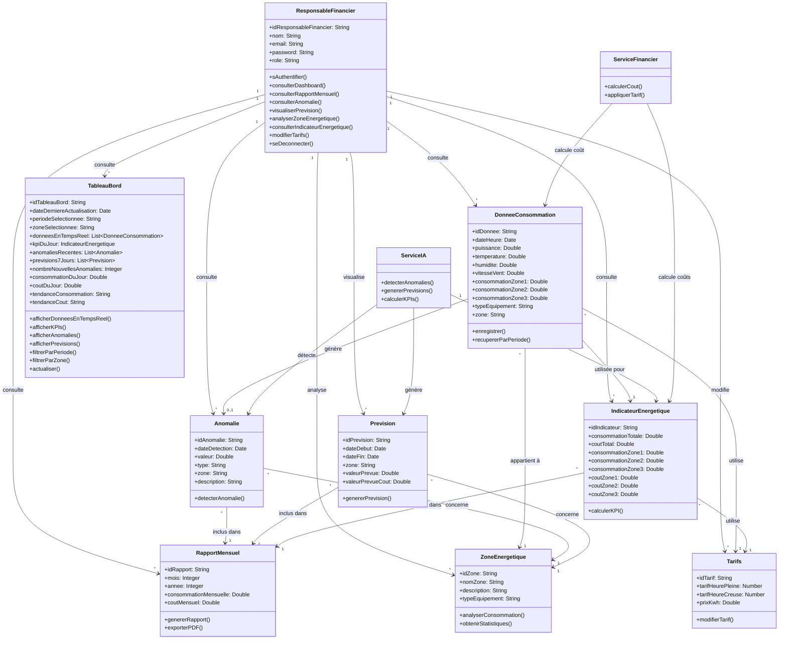

# 🔍 Analyse des Associations Manquantes

## Ce qui manque dans votre diagramme :

---

## 1. **ASSOCIATIONS MANQUANTES ESSENTIELLES**

| Association | Type | Multiplicité | Description |
|-------------|------|--------------|-------------|
| `ResponsableFinancier` → `Anomalie` | Consulte | 1 → * | Le responsable consulte les anomalies |
| `ResponsableFinancier` → `Prevision` | Visualise | 1 → * | Le responsable visualise les prévisions |
| `ResponsableFinancier` → `DonneeConsommation` | Consulte | 1 → * | Le responsable consulte les données |
| `ResponsableFinancier` → `ZoneEnergetique` | Analyse | 1 → * | Le responsable analyse les zones |
| `ResponsableFinancier` → `IndicateurEnergetique` | Consulte | 1 → * | Le responsable consulte les indicateurs |
| `DonneeConsommation` → `Tarifs` | Utilise | * → 1 | Les données utilisent les tarifs pour calculer les coûts |
| `DonneeConsommation` → `Anomalie` | Génère | 1 → 0..1 | Une donnée peut générer une anomalie |
| `DonneeConsommation` → `IndicateurEnergetique` | Utilisée pour | * → 1 | Les indicateurs sont calculés à partir des données |
| `Anomalie` → `ZoneEnergetique` | Concerne | * → 1 | Une anomalie concerne une zone |
| `Prevision` → `ZoneEnergetique` | Concerne | * → 1 | Une prévision concerne une zone |
| `IndicateurEnergetique` → `Tarifs` | Utilise | * → 1 | Les indicateurs utilisent les tarifs |
| `IndicateurEnergetique` → `RapportMensuel` | Inclus dans | * → 1 | Les indicateurs sont dans le rapport |

---

## 2. **MULTIPLICITÉS MANQUANTES**

Votre diagramme n'a pas de multiplicités (ex: `1`, `*`, `0..*`, `1..*`). Exemples :

- `ResponsableFinancier` 1 → * `RapportMensuel` (1 responsable consulte plusieurs rapports)
- `RapportMensuel` * → 1 `ResponsableFinancier` (plusieurs rapports pour 1 responsable)
- `DonneeConsommation` * → 1 `ZoneEnergetique` (plusieurs données pour 1 zone)

---

## 3. **CLASSES MANQUANTES**

| Classe | Rôle |
|--------|------|
| `TableauBord` | Interface principale affichant les données |
| `ServiceIA` | Détecte anomalies + génère prévisions |
| `ServiceFinancier` | Calcule les coûts |

---

## 4. **DIAGRAMME CORRIGÉ COMPLET**

---

## 5. **ATTRIBUTS DÉTAILLÉS DE LA CLASSE TABLEAUBORD**

| Attribut | Type | Description |
|----------|------|-------------|
| `idTableauBord` | String | Identifiant unique du tableau de bord |
| `dateDerniereActualisation` | Date | Date et heure de la dernière actualisation |
| `periodeSelectionnee` | String | Période sélectionnée (jour, semaine, mois, année) |
| `zoneSelectionnee` | String | Zone sélectionnée pour le filtrage |
| `donneesEnTempsReel` | List&lt;DonneeConsommation&gt; | Liste des données en temps réel des capteurs |
| `kpiDuJour` | IndicateurEnergetique | Indicateurs de performance du jour |
| `anomaliesRecentes` | List&lt;Anomalie&gt; | Liste des anomalies récentes (dernières 24h) |
| `previsions7Jours` | List&lt;Prevision&gt; | Prévisions de consommation pour les 7 prochains jours |
| `nombreNouvellesAnomalies` | Integer | Nombre d'anomalies non lues |
| `consommationDuJour` | Double | Consommation totale du jour en kWh |
| `coutDuJour` | Double | Coût total du jour en Dinars Tunisiens (DT) |
| `tendanceConsommation` | String | Tendance de consommation ("augmente", "diminue", "stable") |
| `tendanceCout` | String | Tendance des coûts ("augmente", "diminue", "stable") |

### Méthodes de TableauBord :
- `afficherDonneesEnTempsReel()` : Affiche les données des capteurs en temps réel
- `afficherKPIs()` : Affiche les indicateurs de performance
- `afficherAnomalies()` : Affiche la liste des anomalies
- `afficherPrevisions()` : Affiche les prévisions de consommation
- `filtrerParPeriode()` : Filtre les données par période (jour/semaine/mois)
- `filtrerParZone()` : Filtre les données par zone énergétique
- `actualiser()` : Actualise toutes les données du tableau de bord

---

## 6. **RÉSUMÉ DES AMÉLIORATIONS**

1. ✅ Ajouter les **12 associations manquantes**
2. ✅ Ajouter les **multiplicités** (1, *, 0..1, etc.)
3. ✅ Ajouter les **3 classes manquantes** (TableauBord, ServiceIA, ServiceFinancier)
4. ✅ Ajouter les **relations avec les services**
5. ✅ Ajouter les **13 attributs détaillés** pour TableauBord
